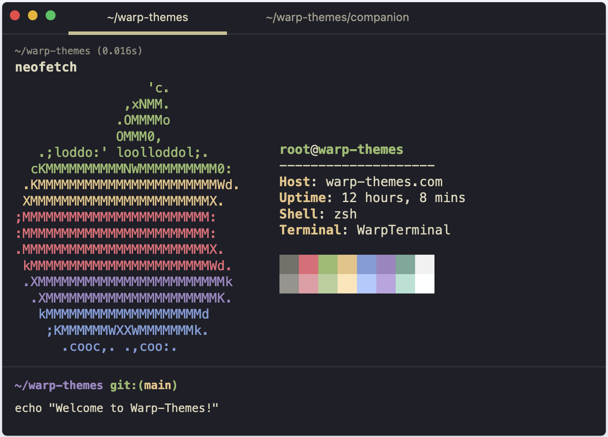
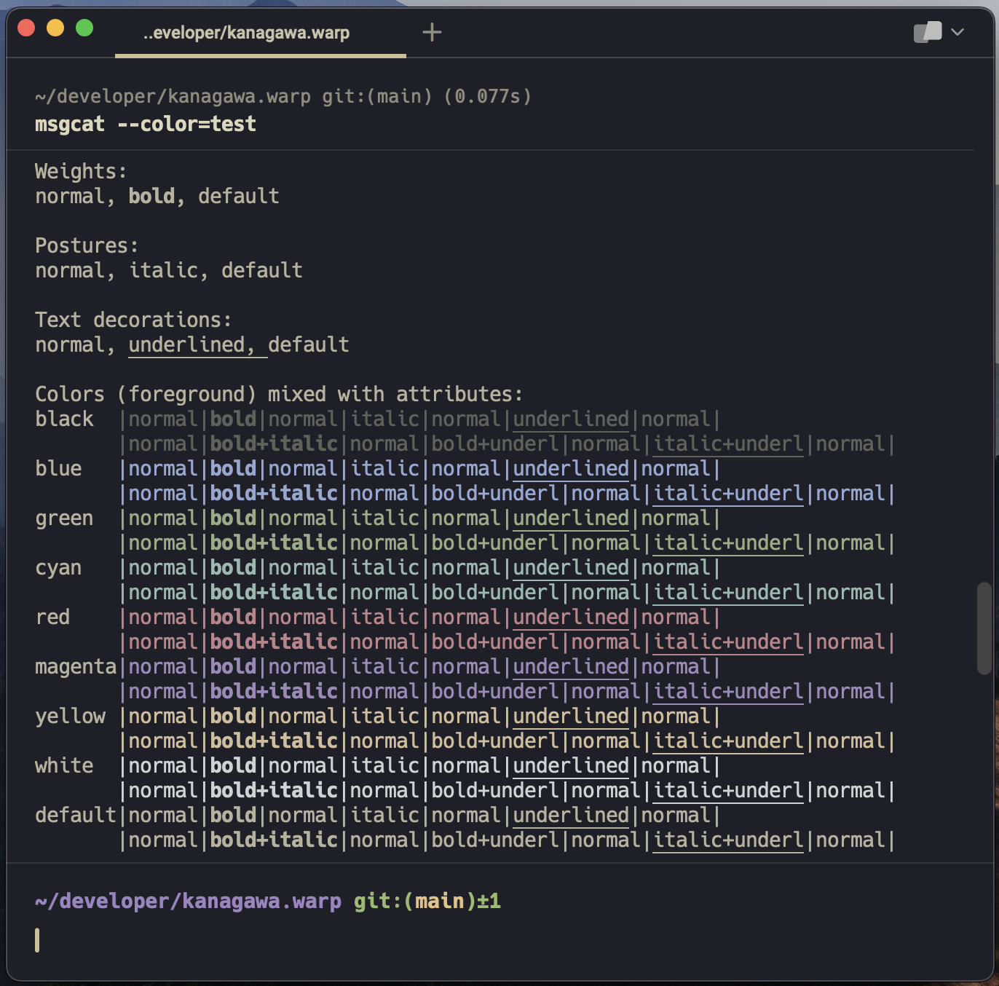

<h2 align="center">
  Warp terminal port of <a href="https://github.com/rebelot/kanagawa.nvim">kanagawa.nvim</a> 🌊
</h2>

<div align="center">
  
</div>

</br>

<p align="center">
  A dark theme inspired by the colors of the famous painting by Katsushika Hokusai.
</p>

</br>

<div align="center">
  
  </br></br>
  
</div>

</br>

## Requirements

- Latest version of [Warp](https://www.warp.dev/)

## Installation

- Download the `kanagawa.yaml` file from the `themes` directory
- Place the file into `~/.warp/themes/`
- Restart Warp

## Usage

- Open Warp
- Press `Control` `Command` `T` to open the theme picker
- Select `Kanagawa` and enjoy your new theme ✨

## Configuration

- Color palette has been slightly modified to improve readability in the terminal
- Happy with the colors? No further configuration necessary!
- Open and make changes to the `kanagawa.yaml` file to make changes

```yaml
accent: "#C8C093"
background: "#1F1F28"
foreground: "#DCD7BA"
details: "darker"
terminal_colors:
  normal:
    black: "#727169"
    red: "#E46876"
    green: "#98BB6C"
    yellow: "#E6C384"
    blue: "#7E9CD8"
    magenta: "#9d85c2"
    cyan: "#76a89a"
    white: "#f1f1f1"
  bright:
    black: "#96948d"
    red: "#e79ca5"
    green: "#b7cf9b"
    yellow: "#ffe5b6"
    blue: "#b0caff"
    magenta: "#bca4e1"
    cyan: "#b2e1d3"
    white: "#feffff"
```

To make your own Warp theme, visit [warp-themes.com](https://warp-themes.com/)
